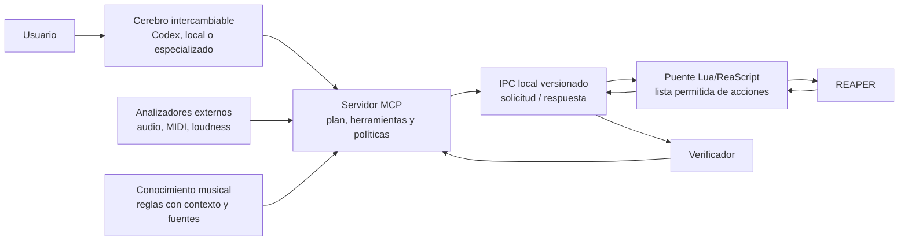

# Arquitectura validada

## Conclusión

REAPER sigue siendo una buena base para este proyecto. ReaScript permite
acciones, lectura del estado, control de efectos, undo y ejecución diferida. El
servidor MCP no reemplaza a REAPER ni contiene el criterio musical: traduce un
contrato estable entre cualquier cerebro y un adaptador local controlado.



## Qué corregimos respecto de la idea inicial

1. **No adoptar un MCP existente como núcleo completo.** Los proyectos
   revisados son valiosos como catálogo y referencia, pero algunos concentran
   cientos de acciones, transporte y parseo JSON en un único script Lua. Se
   portarán sólo operaciones entendidas, con pruebas y respetando sus licencias.
2. **No confundir automatización con criterio musical.** El primer objetivo es
   ejecutar y verificar cambios de manera fiable. La mezcla autónoma de calidad
   llegará después y se medirá con sesiones de referencia.
3. **No confiar en índices mutables.** Las pistas, tomas y efectos se
   identificarán por GUID siempre que REAPER lo permita. Los índices sólo serán
   datos observados de corta duración.
4. **No declarar éxito al aceptar un comando.** Cada operación informa cuatro
   niveles posibles: transporte, estado leído, señal medida y evaluación
   perceptual. Un nivel nunca implica automáticamente el siguiente.
5. **No ejecutar análisis pesado en el hilo de REAPER.** Lua aplica y consulta
   cambios breves; audio, MIDI, búsqueda y modelos se ejecutan fuera del DAW.
6. **No permitir Lua o acciones arbitrarias.** El puente contiene un registro
   explícito de acciones, valida parámetros, limita rutas y devuelve errores
   estructurados.

## Contrato del IPC

El transporte por archivos es suficiente para el MVP si se trata como un
protocolo real:

- versión de protocolo y UUID por solicitud;
- escritura en archivo temporal y renombrado atómico;
- un único consumidor que reclama cada solicitud;
- plazo de expiración y respuesta correlacionada;
- tamaño limitado, parámetros tipados y acciones permitidas;
- directorios separados para pendientes, en proceso, respuestas y cuarentena;
- limpieza controlada de mensajes obsoletos.

Este mecanismo ofrece control visible en pocos milisegundos o decenas de
milisegundos, pero no procesamiento de audio en tiempo real de muestra a muestra.

## Escritura y verificación

Una mutación se modela como transacción:

```text
snapshot mínimo -> begin undo -> localizar por GUID -> validar contexto
-> escribir -> volver a leer -> comparar tolerancias -> end undo -> responder
```

Si la lectura posterior no coincide, se devuelve un fallo verificable. La
decisión de deshacer automáticamente dependerá de la política de cada operación.
Siempre se informa el estado de automatización, bypass/offline y el modo de paneo
que puedan alterar el efecto audible de un valor escrito.

## Límites del primer MVP

- Sólo modo supervisado e interactivo.
- Sólo efectos nativos con adaptadores explícitos, actualmente ReaEQ, ReaComp,
  ReaGate y ReaLimit.
- Sin mastering autónomo, generación musical ni modelo especialista.
- Sin interfaz gráfica adicional.
- Sin escritura concurrente de varios agentes.
- Sin prometer pendientes o unidades musicales que el plug-in no exponga.

## Compatibilidad del cerebro

MCP es la frontera externa; las herramientas no reciben ni devuelven estructuras
propias de Codex. Codex será el primer cliente, pero un LLM local u otro proveedor
podrá usar el mismo catálogo. Los modelos musicales especializados serán
consultores de sólo lectura y entregarán propuestas al orquestador, nunca cambios
directos en REAPER.

## Fuentes primarias revisadas

- [REAPER ReaScript](https://www.reaper.fm/sdk/reascript/reascript.php)
- [Referencia de la API ReaScript](https://www.reaper.fm/sdk/reascript/reascripthelp.html)
- [Documentación de MCP en Codex](https://developers.openai.com/codex/mcp)
- [SDK oficial de MCP para Python](https://github.com/modelcontextprotocol/python-sdk)
- [TwelveTake reaper-mcp](https://github.com/TwelveTake-Studios/reaper-mcp)
- [mthines reaper-mcp](https://github.com/mthines/reaper-mcp)
- [total-reaper-mcp](https://github.com/shiehn/total-reaper-mcp)
- [Music Flamingo de NVIDIA](https://research.nvidia.com/labs/adlr/MF/)
- [DAWZY: Agentic AI for DAWs](https://arxiv.org/abs/2512.03289)
